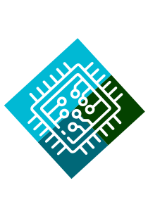

<table>
<tr>
<td>
  
</td>
<td>
  <h1 style="font-size: 48px; margin: 0; ">GateSim</h1>
</td>
</tr>
</table>

A browser-based digital logic circuit simulator built with React.

  <a href="https://arpit-shinde.github.io/GateSim/"><strong>Try GateSim Online</strong></a>

  <a href="https://github.com/Arpit-Shinde/GateSim/releases/download/v1.0.0/GateSim.Setup.1.0.0.exe"><strong>Download for Windows</strong></a>

---

## What is GateSim?

GateSim is an interactive simulator for learning and experimenting with **Digital Logic Design (DLD)**.

## Features

### Circuit Construction

- Dynamic gate creation
- Interactive wiring
- Wire and gate deletion
- Support for gates with 2, 3, and 4 inputs
- Move components freely on an infinite canvas
- Pan and zoom
- Rotate gates

### Logic Components

### Basic gates

- AND
- OR
- NOT
- NAND
- NOR
- XOR
- XNOR

### Combinational circuits

- Multiplexers
- Adders

### Sequential circuits

- Clocks
- Master-Slave JK Flip-Flops

### Component Creation

- Create reusable components from existing circuits
- Define custom circuit components
- Use created components as building blocks in larger circuits

More sequential and combinational components are being added as development continues.

### Circuit Management

- Save circuits
- Load circuits
- Undo / Redo
- Reset view
- Clear circuit

## Limitations

GateSim is still under active development. Some aspects of real digital hardware are intentionally simplified.

* No propagation delay simulation
* Level-triggered flip-flops may exhibit race-around behavior
* Master-Slave JK Flip-Flops can be used when edge-like behavior is required
* Mobile support is limited; GateSim is primarily designed for desktop and PC use

## Learning Guide

GateSim is being developed not only as a circuit simulator, but also as a learning environment for Digital Logic Design.

Topics will progressively cover areas such as:

* Logic gates
* Boolean algebra
* Truth tables
* Combinational circuits
  * Adders
  * Multiplexers
* Sequential logic
  * Latches and flip-flops
  * Registers
  * Counters
  * Memory

## Custom Components

GateSim allows users to create reusable components from circuits they have already built.

A circuit can be selected and converted into a custom component by defining its input and output pins. The resulting component can then be added to the circuit like any other component.

This allows larger circuits to be constructed hierarchically from smaller building blocks.

## Circuit Saving

Circuits can be saved and loaded so that designs can be continued later or shared between users.

## Future Development

Planned development includes:

* Expanded learning material
* More combinational and sequential components
* Further usability improvements based on student feedback
* Adding architecture explaination in README

